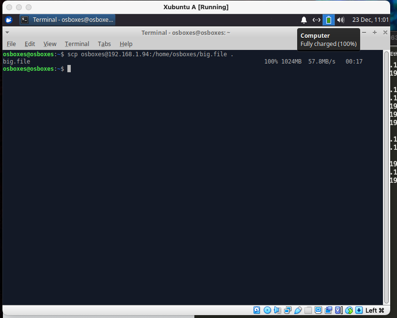
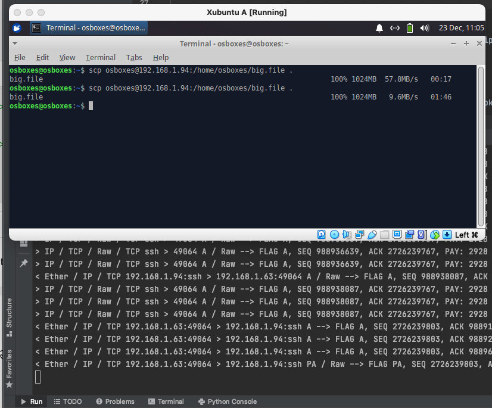
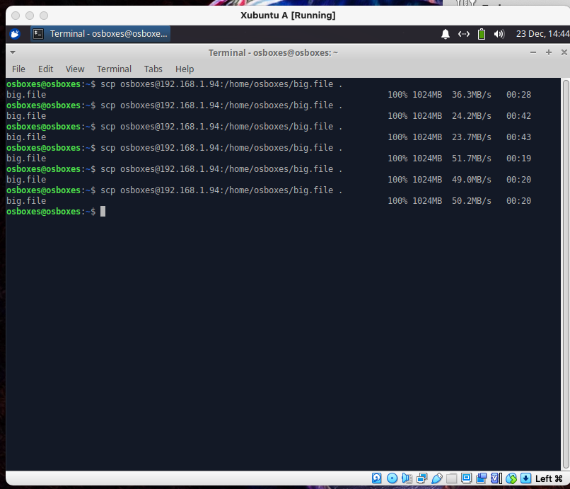
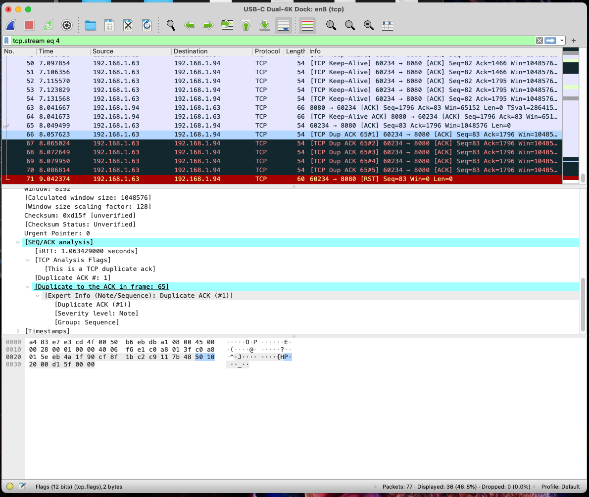
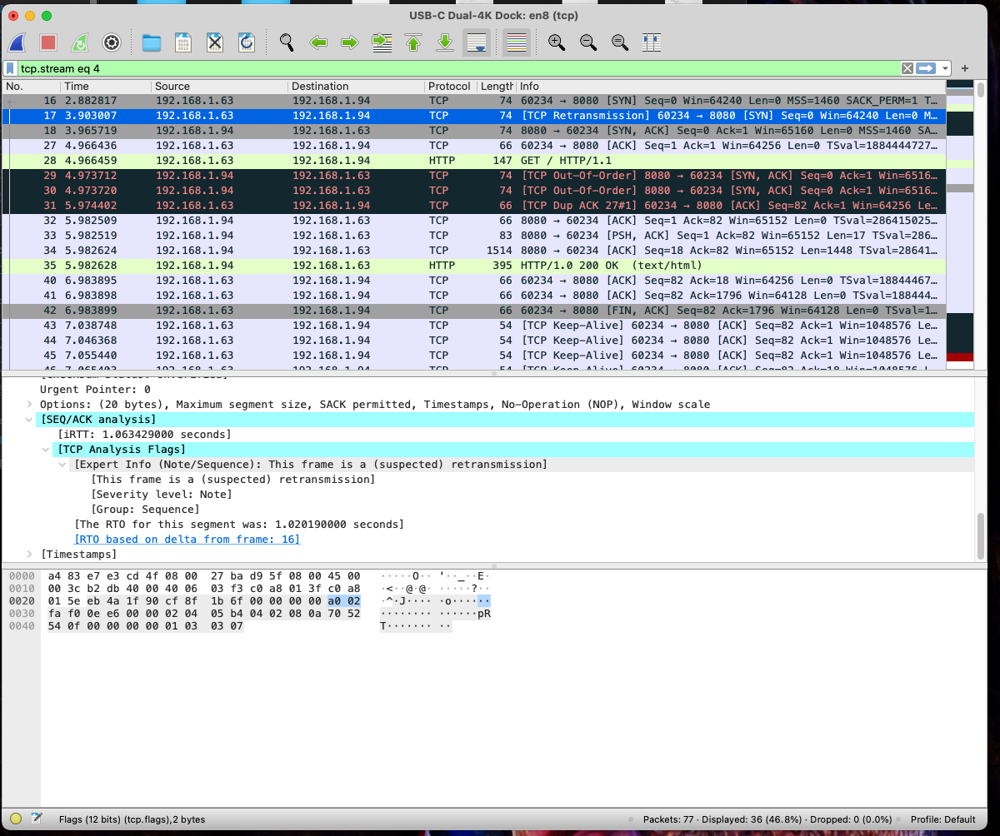

# Throttling TCP connections

The objective of this task is to slow down TCP connections by forcing retransmission of packets. The following
implementation sniffs the packet on the network and sends three TCP ACK packets to the server, in order to force server
to resend the data

## How to

The implementation is in the Python using Scapy library.

### Requirements

* Linux / MacOS
* Python >= 3.8 (should work 3.6, but tested on 3.8)
* Scapy >= 2.4.4

### Execution

One needs to run the script as a root, in order to allow packets sniffing by Scapy. Please see the code before executing
it as a root.

```bash
sudo ./main.py <src ip addr> <dst ip addr>
```

## Testing Environment

To test the implementation we set up the following network:

1. Client VM, `192.168.1.63` running in VirtualBox Xubuntu 20.04 with bridged adapter
2. Server VM, `192.168.1.94` running in VirtualBox Xubuntu 20.04 with bridged adapter
3. Adversary, the host machine on `192.168.1.64` running MacOS 11.1 executing the script

### Issues with setup

On the latest MacOS, Scapy is not able to use `libpcap` library,
see [the issue](https://github.com/secdev/scapy/issues/2870). Thus, the filtering on TCP is done manually
in [filter.py](filter.py).

## Performance

In order to test the solution, we created a 1GB file on the Server machine:

```bash
fallocate -l 1GB big.file
```

Then, with disabled sniffing and without any network modification, we run

```bash
scp osboxes@192.168.1.94:/home/osboxes/big.file .
```

between the VMs with following result.


Then, we run the second test, when we run the sniffing on the host machine. There was a significant performance
reduction.


To verify the results, we run the tests multiple times, which verified the functionality. The first three trials are
with sniffing enabled, the later three without any network changes.


## Packets

We closely analyzed the packets captured on the host machine with the Wireshark. In order to get the best result with as
least packets as possible, we analyzed the TCP traffic of an HTTP request. Where on the server VM, we started the simple
http server:

```bash
python2 -m SimpleHTTPServer 8080
```

Then on the client VM we simply accessed it using `curl`.

```bash
curl 192.168.1.94:8080
```

Unfortunately, on this setup, the adversary machine was sending the TCP ACKs too slowly. In other words, the client was
able to send the ACK faster than the adversary, thus we only saw the ACK duplicated.


In order to slow down the processing of the TCP packets, we artificially slowed down the VMs with the following
settings:

```bash
sudo tc qdisc add dev enp0s3 root netem delay 500ms
```

However, this setting was on only during the packet exploration, not during the performance testing as described in the
previous headline.

Using the artificial slowdown, we were able to see the retransmitted packets.
